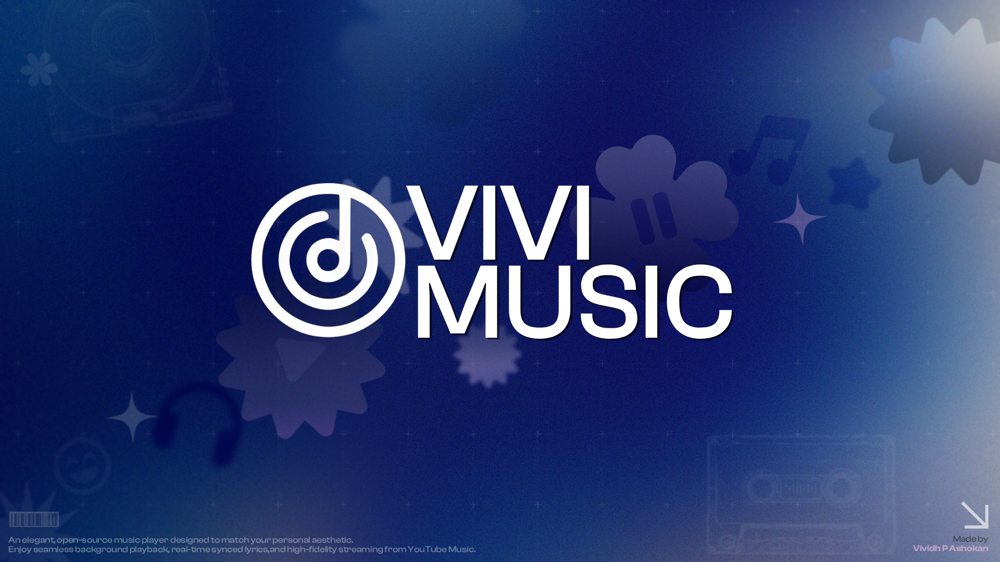

  
   
  <h1>VIVI Music</h1>
  <h3>More Than Just Music — Your Ultimate Audio Experience</h3>

  

    
    
    
    
  

<h2>🎵 About VIVI</h2>

<table align="center" width="100%">
  <tr valign="middle">
    <td width="60%" align="left">
      
✨ <b>VIVI</b> isn't just another music player — it's a premium, modern audio ecosystem engineered for listeners who demand more. Powered by a responsive design engine that dynamically matches your album art's color palette, VIVI completely shifts to match your aesthetic on every single beat.

      
From stunning animated canvas visualizers to fluid physics-based micro-animations, every interaction is crafted to elevate your listening. Stream ad-free, sync karaoke lyrics, share your sound instantly, and enjoy an elegant interface designed with modern Material 3 guidelines.

      <blockquote>
        <b>🎵 Your music, your aesthetic — only with VIVI.</b>
      </blockquote>
    </td>
    <td width="40%" align="center">
      
🛡️ <b>100% Privacy-First</b> <small>Completely local database. Absolutely zero trackers, analytics, or background telemetry.</small>

      

      
🎨 <b>Material You Engine</b> <small>Stunning adaptive interface that dynamically morphs colors based on what's playing.</small>

      

      
🚀 <b>Ad-Free Streaming</b> <small>Seamless background playback with high-fidelity streams from YouTube Music.</small>

    </td>
  </tr>
</table>

<h2>📸 Screenshots</h2>

<table align="center">
  <tr valign="top">
    <td align="center">
      <b>Player</b>  
      
    </td>
    <td align="center">
      <b>Player</b>  
      
    </td>
    <td align="center">
      <b>Artist Screen</b>  
      
    </td>
  </tr>
  <tr valign="top">
    <td align="center">
      <b>Album Page</b>  
      
    </td>
    <td align="center">
      <b>Search Section</b>  
      
    </td>
    <td align="center">
      <b>Home Page</b>  
      
    </td>
  </tr>
  <tr valign="top">
    <td align="center">
      <b>Built-in Updater</b>  
      
    </td>
    <td align="center">
      <b>Audio Control Section</b>  
      
    </td>
    <td></td>
  </tr>
</table>

<h2>✨ Features</h2>

<table align="center" width="100%">
  <tr valign="top">
    <td width="50%">
      <h3>🎨 Expressive UI & Design</h3>
      <ul>
        <li><b>Dynamic Material You:</b> Beautiful adaptive colors that shift to match your playing album art.</li>
        <li><b>Premium Animations:</b> Silky-smooth micro-animations and seamless screen transitions.</li>
        <li><b>Modern Architecture:</b> Sleek, modern layouts engineered with Android's latest Material 3 guidelines.</li>
      </ul>
    </td>
    <td width="50%">
      <h3>🎵 Advanced Streaming</h3>
      <ul>
        <li><b>Full Catalog Integration:</b> Stream any song from YouTube and YT Music, completely ad-free.</li>
        <li><b>Animated Canvas:</b> Stunning Apple Music-style animated backdrops that bring music to life.</li>
        <li><b>Background Playback:</b> High-quality continuous playback with full notification drawer controls.</li>
      </ul>
    </td>
  </tr>
  <tr valign="top">
    <td width="50%">
      <h3>📝 Synced Lyrics & Audio</h3>
      <ul>
        <li><b>Karaoke Syncing:</b> Beautiful, precise word-by-word highlighted lyrics.</li>
        <li><b>Integrated EQ:</b> High-fidelity audio customization with an in-app Equalizer.</li>
      </ul>
    </td>
    <td width="50%">
      <h3>📥 Offline Experience</h3>
      <ul>
        <li><b>Local Downloads:</b> Download and cache tracks onto your device for offline enjoyment.</li>
        <li><b>Smart Storage:</b> Intelligent cache management that optimizes space automatically.</li>
      </ul>
    </td>
  </tr>
  <tr valign="top">
    <td width="50%">
      <h3>🔄 OTA Updater</h3>
      <ul>
        <li><b>Seamless Updates:</b> Instant Over-the-Air updates directly inside the app.</li>
        <li><b>Direct Delivery:</b> Always stay ahead with instant feature upgrades and patch fixes.</li>
      </ul>
    </td>
    <td width="50%">
      <h3>🛡️ 100% Privacy</h3>
      <ul>
        <li><b>Zero Data Collection:</b> No trackers, no telemetry, and no telemetry analytics.</li>
        <li><b>Local Security:</b> All user libraries, preferences, and downloaded tracks are stored locally.</li>
      </ul>
    </td>
  </tr>
</table>

 

  <table border="0" cellpadding="15" cellspacing="0" width="85%">
    <tr>
      <td align="center">
        <h3>💖 Support the Project</h3>
        
If you love VIVI Music and want to support its maintenance and active development, please consider buying me a coffee! Your support helps keep this premium audio experience completely active, clean, and ad-free.

         
        
      </td>
    </tr>
  </table>

 

<h2>🚗 Android Auto Setup</h2>

If VIVI Music doesn't appear in Android Auto:

<ol>
  <li>Open <strong>Android Auto</strong> on your phone</li>
  <li>Tap the <strong>hamburger menu</strong> (three lines) and go to <strong>Settings</strong></li>
  <li>Scroll to the bottom and tap the <strong>version number</strong> multiple times to enable Developer Settings</li>
  <li>Tap the <strong>three dots menu</strong> (⋮) at the top-right</li>
  <li>Select <strong>Developer settings</strong></li>
  <li>Enable <strong>Unknown sources</strong></li>
  <li>Restart Android Auto and connect to your car</li>
</ol>

<h2>🤝 Contributing</h2>

Contributions are welcome! Whether it's bug reports, feature requests, or code contributions:

<ol>
  <li>Fork the repository</li>
  <li>Create your feature branch (<code>git checkout -b feature/AmazingFeature</code>)</li>
  <li>Commit your changes (<code>git commit -m 'Add some AmazingFeature'</code>)</li>
  <li>Push to the branch (<code>git push origin feature/AmazingFeature</code>)</li>
  <li>Open a Pull Request</li>
</ol>

<h2>🛡️ Privacy & Data Collection</h2>

At <strong>VIVI Music</strong>, your privacy is our top priority. We believe that your music and data belong exclusively to you.

<ul>
  <li><strong>Zero Data Collection:</strong> We do <strong>not</strong> collect, store, or share any of your personal information, usage habits, or listening history.</li>
  <li><strong>100% Local:</strong> All your settings, downloaded tracks, and offline caches are stored securely on your device.</li>
  <li><strong>No Tracking:</strong> There are no hidden trackers, analytics, or background services monitoring your activity.</li>
</ul>

Enjoy your music with complete peace of mind, knowing that your privacy is fully protected.

<h2>📜 Disclaimer</h2>

This project and its contents are <strong>not affiliated with, funded, authorized, endorsed by, or in any way associated with</strong> YouTube, Google LLC, or any of their affiliates and subsidiaries.

Any trademark, service mark, trade name, or other intellectual property rights used in this project are owned by their respective owners.

<strong>VIVI Music</strong> is an independent project created for educational and personal use purposes.

<h2>📄 License & Guidelines</h2>

This project is licensed under the terms specified in the <a href="LICENSE">LICENSE</a> (GPL-3.0) file.

If you copy, adapt, or reuse any part of the source code, you must adhere to the guidelines outlined in the <a href="rules.md">rules.md</a> file.

  <table border="0" cellpadding="15" cellspacing="0" width="85%">
    <tr>
      <td align="center">
        <h3>💬 Community & Support</h3>
        
Connect with other music lovers, suggest new features, report bugs, and stay updated with the latest releases!

         
        
          
        
          <a href="https://github.com/vivizzz007/vivi-music/issues">🐞 Report Bugs</a> &nbsp;•&nbsp;
          <a href="https://github.com/vivizzz007/vivi-music/discussions">💬 Discussions</a> &nbsp;•&nbsp;
          <a href="https://github.com/vivizzz007/vivi-music/releases">🚀 Releases</a>
        
      </td>
    </tr>
  </table>

  <h2>🙏 Special Thanks & Credits</h2>

  
VIVI Music is built upon the foundation of amazing open-source projects and developers:

   

  <table border="0" cellpadding="10" cellspacing="0" width="90%">
    <tr valign="top">
      <td width="40%" align="left">
        <b>💡 Special Thanks</b>
        <ul>
          <li><strong><a href="https://github.com/mostafaalagamy">Mostafa Alagamy</a></strong> – For their inspiration and contributions to the open source community.</li>
          <li><strong><a href="https://github.com/ZemerTeam/zemer-cipher">@Zemer</a></strong> – Huge congratulations and thanks for inventing the new playback method! 🎉</li>
        </ul>
      </td>
      <td width="60%" align="left">
        <b>🎖️ Foundational Projects</b>
        <ul>
          <li><strong><a href="https://github.com/better-lyrics/better-lyrics">Better Lyrics</a></strong> – For beautiful synced lyrics and YouTube Music integration.</li>
          <li><strong><a href="https://github.com/maxrave-dev/SimpMusic">SimpMusic</a></strong> – For lyrics functionality and integration logic.</li>
          <li><strong><a href="https://github.com/ibratabian17/YouLyPlus">YouLyPlus</a></strong> – For smooth in-app lyrics styling.</li>
          <li><strong><a href="https://github.com/monochrome-music/monochrome">Monochrome</a></strong> – For the premium Apple Music-style visualizer canvas.</li>
        </ul>
      </td>
    </tr>
  </table>

   
  
The open-source community for tools, libraries, and APIs that make this project possible.

  
<strong>Thank you to all the amazing developers who made this project possible!</strong>

  

  
<strong>Made with ❤️ for music lovers everywhere</strong>

  
⭐ Star this repo if you enjoy VIVI Music!

