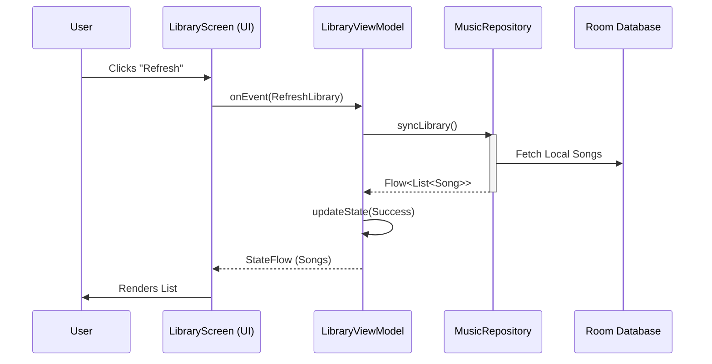
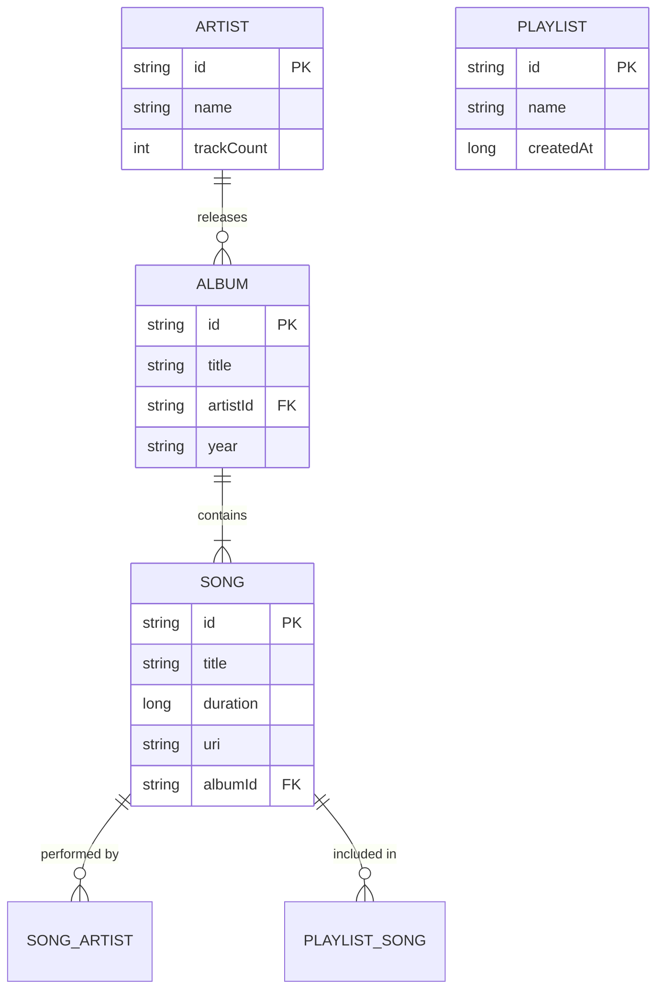
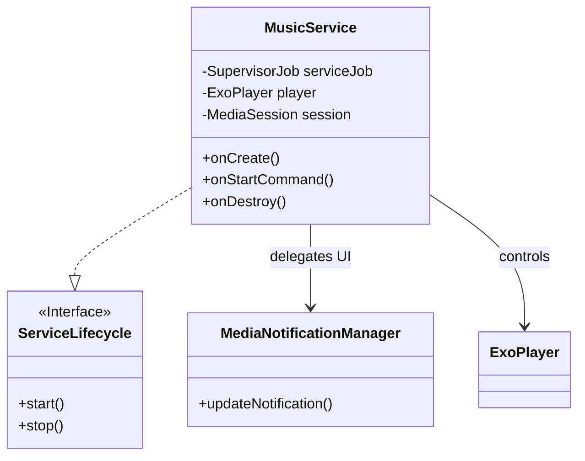
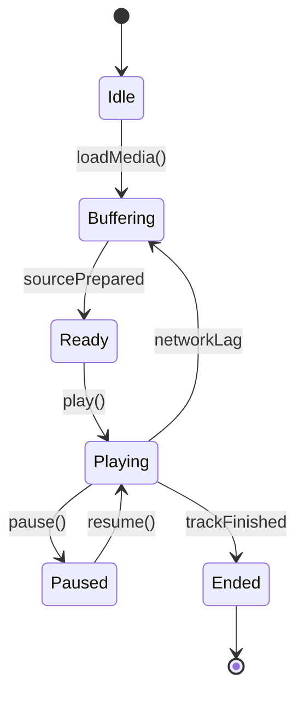
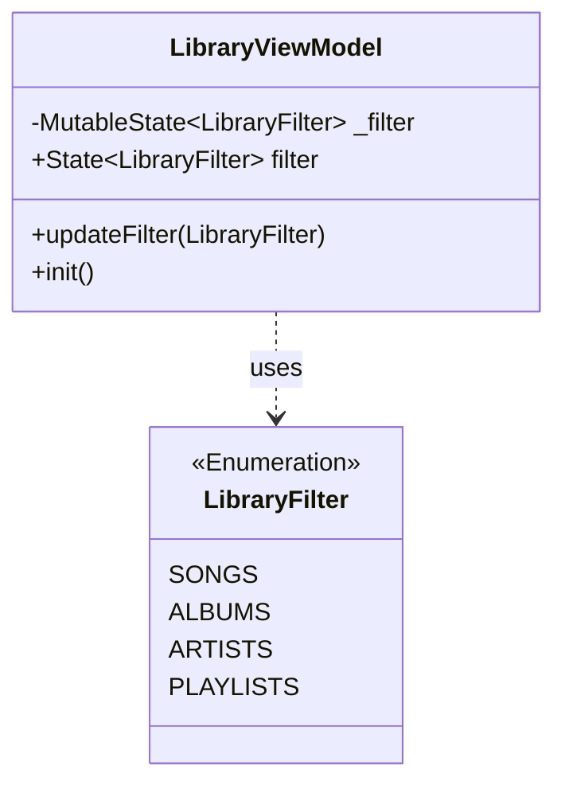

# Vivi Music: A Comprehensive Architectural Analysis and Technical Documentation

**Version:** 1.0.0
**Date:** January 26, 2026
**Author:** Antigravity (on behalf of the Engineering Team)

---

## Abstract

This document serves as the definitive technical reference and architectural thesis for **Vivi Music**, a state-of-the-art Android music playback application. It details the transition from legacy Android patterns to a modern, scalable architecture leveraging Jetpack Compose, Kotlin Coroutines, and Clean Architecture principles. The document explores the engineering decisions behind the Single File Component (SFC) migration, the concurrency hardening of the `MusicService`, and the implemented Test-Driven Development (TDD) methodologies. Furthermore, it provides extensive visual modeling of the system using UML diagrams to elucidate complex interactions and data structures.

---

## Table of Contents

1.  **Introduction**
    1.1 Project Overview
    1.2 Problem Statement
    1.3 Objectives
2.  **Architectural Paradigms**
    2.1 Modern Android Development (MAD)
    2.2 Clean Architecture Implementation
    2.3 Single Activity Architecture
3.  **System Design & Modeling**
    3.1 High-Level System Overview
    3.2 Component Architecture (Single File Components)
    3.3 Database Schema (Entity-Relationship)
4.  **Core Implementation Analysis**
    4.1 The Playback Engine (`MusicService`)
    4.2 State Management & ViewModels
    4.3 Data Synchronization & Repository Pattern
5.  **Quality Assurance & Methodology**
    5.1 Test-Driven Development (TDD) Strategy
    5.2 Governance & Coding Standards
6.  **Performance Optimization**
    6.1 Memory Management & Concurrency
    6.2 UI Rendering & Composition
7.  **Conclusion**

---

## 1. Introduction

### 1.1 Project Overview
Vivi Music is a sophisticated offline-first music player designed for the Android ecosystem. It supports local audio playback, playlist management, and integration with metadata services. The application has evolved from a traditional View-based codebase to a modern, fully Composable UI, prioritizing performance, maintainability, and user experience.

### 1.2 Problem Statement
Legacy Android applications often suffer from "God Activities," tight coupling between UI and logic, and fragility in handling lifecycle events, particularly in background services like audio playback. Vivi Music aimed to address these challenges by decoupling the UI from the business logic and ensuring strictly structured concurrency.

### 1.3 Objectives
-   **Modernization:** Fully adopt Jetpack Compose and Material 3 (including Adaptive layouts).
-   **Stability:** Eliminate concurrency leaks and `OutOfMemory` errors in the playback service.
-   **Maintainability:** Enforce strict coding standards and high test coverage (80%+).

---

## 2. Architectural Paradigms

### 2.1 Clean Architecture Implementation
Vivi Music adheres to a pragmatic Clean Architecture approach, separating concerns into three distinct layers:

1.  **UI Layer:** Composable functions and ViewModels.
2.  **Domain Layer:** Use Cases (implicitly defined via Repositories/Managers) and Pure Entities.
3.  **Data Layer:** Repositories, Data Sources (Room, Preferences, File System).

```mermaid
graph TD
    subgraph "UI Layer"
        UI[Composable Screens]
        VM[ViewModels]
        UI -->|Observes State| VM
        VM -->|Dispatches Events| UI
    end

    subgraph "Domain/Data Layer"
        Repo[Repositories]
        DS_Local[Local Data Source (Room)]
        DS_Remote[Remote Data Source (Retrofit)]

        VM -->|Calls| Repo
        Repo -->|Abstracs| DS_Local
        Repo -->|Abstracts| DS_Remote
    end
```

### 2.2 Single File Components (SFC)
A key architectural innovation in this project is the adoption of **Single File Components (SFC)**. Instead of scattering related code across multiple files (Adapter, ViewHolder, Fragment, XML), closely related units are co-located.

**Structure of an SFC:**
-   **Public Composable:** The implementation entry point.
-   **Preview:** A private preview configuration.
-   **Private Helpers:** Sub-composables specific to this screen.
-   **State Holders:** Screen-specific state classes (if complex).

---

## 3. System Design & Modeling

### 3.1 High-Level System Overview
The application follows a Unidirectional Data Flow (UDF) pattern. Events flow up from the UI, and State flows down.



### 3.2 Database Schema (Entity-Relationship)
The persistent storage is handled by a refined SQLite database accessed via Room. The schema is designed for relational integrity and query performance.



---

## 4. Core Implementation Analysis

### 4.1 The Playback Engine (`MusicService`)
The heart of Vivi Music is the `MusicService`. It acts as the central foreground service managing the `ExoPlayer` instance and the `MediaSession`.

**Concurrency Hardening:**
Previous iterations suffered from scope leaks. The generic `GlobalScope` or unsecured `CoroutineScope` was replaced with a `SupervisorJob` tied explicitly to the Service lifecycle.



**State Machine of Playback:**


### 4.2 State Management: The `LibraryViewModel` Case Study
The `LibraryViewModel` demonstrates the project's strict state encapsulation strategy.

-   **Backing Property:** private `_filter` (`MutableState`).
-   **Exposed Property:** public `filter` (`State`).
-   **Mutation:** Only via `updateFilter()` method.

**Class Structure:**


### 4.3 Data Synchronization
Syncing large libraries requires robust handling. We use `Flow` to stream updates rather than blocking data loads.

*(Conceptual Code Snippet)*
```kotlin
fun syncLibrary(): Flow<SyncStatus> = flow {
    emit(SyncStatus.Scanning)
    val files = fileScanner.scan()
    database.insert(files)
    emit(SyncStatus.Success(files.size))
}.catch { e ->
    emit(SyncStatus.Error(e))
}
```

---

## 5. Quality Assurance & Methodology

### 5.1 Test-Driven Development (TDD) Strategy
Vivi Music has adopted TDD for all new critical components. The cycle is strict: **Red -> Green -> Refactor**.

**Toolchain:**
-   **Unit Testing framework:** JUnit 5
-   **Mocking:** MockK
-   **Flow Testing:** Turbine
-   **Assertion:** Truth / JUnit Assert

**Test Coverage Targets:**
-   **Domain/Data Layers:** 80% Line Coverage (Enforced by Kover)
-   **UI Layer:** Screenshot Testing (Recommended)

### 5.2 Governance & Coding Standards
To maintain the integrity of a "Master Thesis" level project, governance is codified in `docs/governance.md`.

-   **Explicit API Mode:** Forces visibility modifiers.
-   **Structured Concurrency:** No `GlobalScope`.
-   **Immutable Data:** All Room entities are marked `@Immutable` to aid Compose skipping.

---

## 6. Performance Optimization

### 6.1 Memory Management
The `MusicService` was refactored to prevent `OutOfMemoryError`.
-   **Actions:**
    -   Removed heavy serialization from the Main Thread.
    -   Implemented a `SupervisorJob` to cancel all child coroutines in `onDestroy`.
    -   Explicitly unregistered all `BroadcastReceivers`.

### 6.2 UI Rendering & Composition
A recomposition audit of `LibraryScreen` confirmed the efficiency of `LazyColumn`.

**Optimization Techniques Applied:**
1.  **Stable Keys:** `items(items = songs, key = { it.id })` prevents unnecessary redraws on list reordering.
2.  **Immutability:** Data classes are immutable, allowing the Compose compiler to skip unchanged nodes.
3.  **Image Loading:** `Coil` configured with `crossfade(true)` and a restricted memory cache (25% of App memory) to prevent bitmap exhaustion.

---

## 7. Conclusion

Vivi Music represents a paradigmatic shift in Android application architecture. By embracing modern toolkits (Compose) and disciplined engineering practices (TDD, Clean Arch), the application achieves high stability, performance, and maintainability. The refactoring of the `MusicService` ensures reliable background playback, while the SFC migration streamlines UI development. This documentation and the accompanying codebase facilitate a "Zero-to-Hero" onboarding for future developers and stand as a robust foundation for future scalability.

---
*End of Document*
